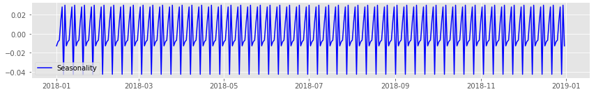
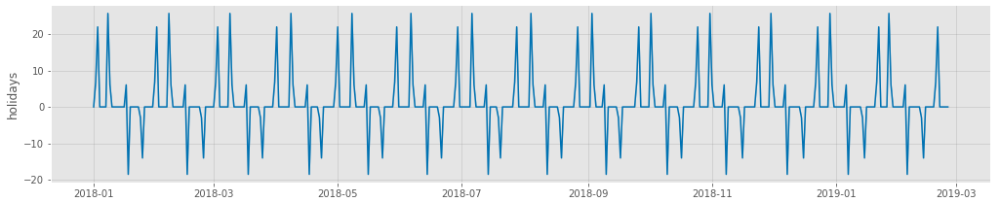
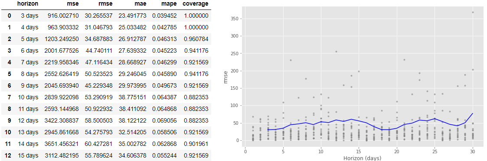
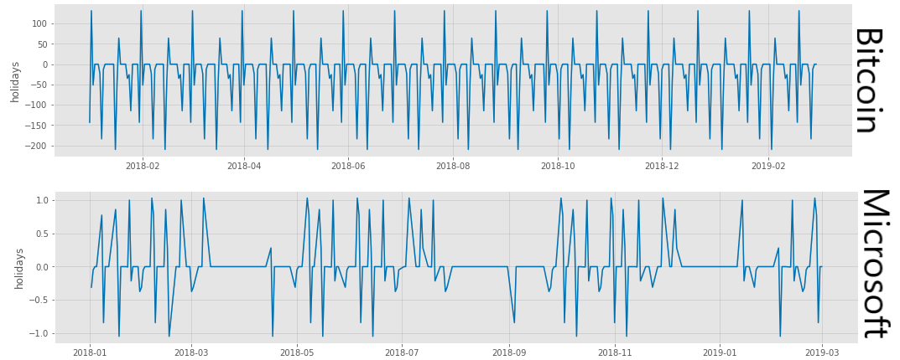
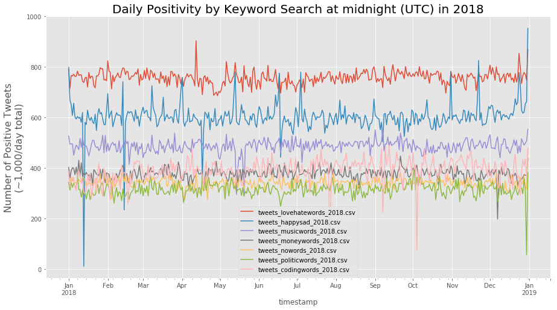
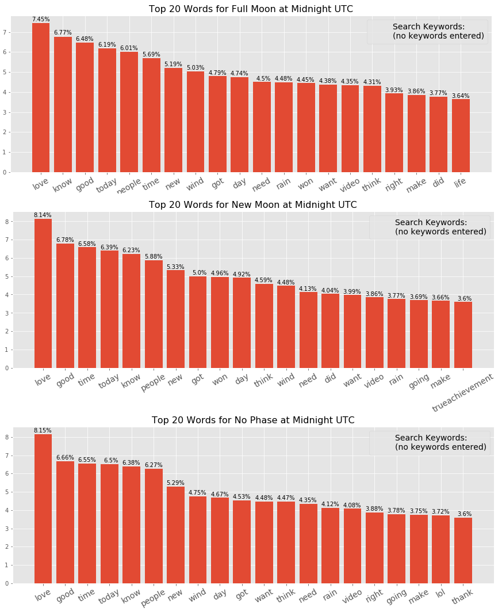
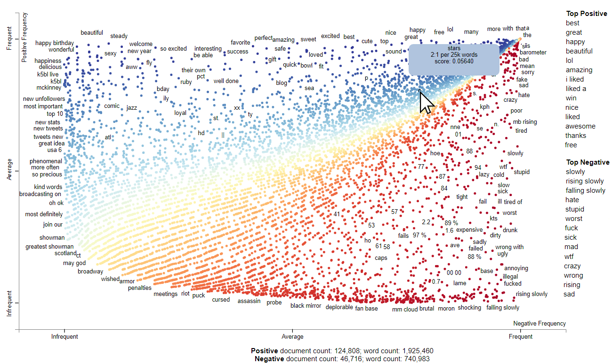

# Lunar Cycles and Human Behavior

## Introduction

This project investigates whether there is any correlation between lunar phases and human behavioral trends, as seen through sentiment analysis of Tweets and time series analysis of stock prices and currency exchange rates. This project was inspired by the contentious academic claims regarding whether lunar cycles affect human behavior (see [Thakur and Sharma, 1984](https://www.ncbi.nlm.nih.gov/pmc/articles/PMC1444800/) and [Shafer, et al., 2010](https://www.sciencedirect.com/science/article/pii/S0047235210000589?via%3Dihub) for two examples of opposing views; there are many scholars on both sides of this debate). 

    

## Overview

The code for this extensive project can be found in the following notebooks:
   * **[Capstone notebook](Capstone.ipynb)**: all of the code necessary for replicating results
   * **[Twitter Scraper notebook](Twitter_scraper.ipynb)**: streamlined code exclusively for scraping Twitter
   * **[Scattertext notebook](Scattertext.ipynb)**: code for generating HTML files for interactive graphs of Twitter searches
   * **[Dashboard](Panel_dashboard.ipynb)**: the dashboard for exploring results
   
For this project, I scraped approximately 1,000 tweets per day for every day of 2018 using a variety of keyword search phrases. This process resulted in a dataset of over 365,000 tweets per search phrase. The resulting datasets were then processed for sentiment and aggregated by date to examine sentiment trends over time. Additionally, daily financial data for 2018 for a variety of stocks, currencies, and market indices were scraped from the internet.

Both Twitter and financial data were then modeled using Facebook Prophet to determine the degree (or absence) of any seasonality correlated to the visible phases of the moon. 

## Methodology

Thankfully, the financial data was in perfect condition after scraping and required only minimal processing to add a few columns before the data could be explored. The Twitter data, however, required fairly extensive cleaning in order to handle emojis, emoticons, links, hashtags, usernames, special characters, and non-ASCII characters.

Once all the data was properly conditioned, I utilized the [TextBlob](https://textblob.readthedocs.io/en/dev/ "TextBlob documentation") library to determine the sentiment of every tweet. I opted to expand the "neutral" polarity value to include all polarity scores from -0.1 to 0.1 (default only assigns "neutral" to exact 0). At this point I utilized statsmodels' [seasonal_decompose](https://www.statsmodels.org/stable/generated/statsmodels.tsa.seasonal.seasonal_decompose.html "Seasonal_decompose documentation") method to determine if the tweets exhibited any seasonality, which they did. 

    

With seasonality in Tweets confirmed, I began modeling with [Facebook Prophet](https://facebook.github.io/prophet/ "Facebook Prophet documentation") to further explore lunar correlations. FBProphet, as new as it is, is a very powerful and adaptive modeling tool. Fortuitously, FBProphet includes a parameter for `Prophet()` called `holidays=` which allows a user to input a properly formatted DataFrame of dates which FBProphet will treat with special attention. Among other things, this functionality models what seasonality effect the `holidays` have upon the time series under investigation. In the graph below, the full moons occur on January 2-3, February 1, March 1-2, etc.

    

Another benefit of FBProphet is the wide variety of `performance_metrics` that are easily accessible. I chose to look at RMSE (root mean squared error) as it is fairly easy to interpret in the units of the original dataset. In virtually all cases, (for both tweets and financial data) the RMSE averaged 50% greater than the modeled seasonality impact of lunar cycles. While not great from a pure predictive standpoint, it is important to note that the goal of the project was to determine if a correlation existed, **not** to create a model that could accurately predict twitter sentiment or stock prices...there are far too many additional variables that would be required for that. Below is an example table of performance metrics and a plot of the RMSE over various time horizons.

    

With Twitter lunar seasonality well established, I then ran the same FBProphet procedures on the financial data. This data also showed distinct seasonality correlated to lunar cycles. However, the correlation was not the same for every financial object. Some stocks/currencies spike positively on full moons while others spike negatively on full moons. Additionally, it seems that for many lunar phases there is an initial spike and then corresponding correction (or even over-correction) on the following day. For example, compare the lunar seasonality graphs generated for Bitcoin and Microsoft below.

    

## Visualizing it all in search of answers

Though this project's end goal was not to create a truly predictive model, hopefully the insights gained may be useful to other data scientists. The identification of a lunar-phase seasonality correlation with financial data may even be useful for incorporation in more advanced models built by investors that take into account dozens (or even hundreds?) of variables to make stock/currency trading decisions. Nevertheless, we can for the moment hope to gain a bit more knowledge of this behavioral lunar cycle through additional visualizations of the Twitter data.

For instance, examine the word cloud at the top of this file that was generated using the [wordcloud](http://amueller.github.io/word_cloud/ "wordcloud documentation") library; it clearly conveys information on word frequencies from that particular keyword search (in this instance: "love OR peace OR hate OR war"). However, with such a large corpus of tweets (+365,000 tweets containing +5,000,000 words) the runtime for even the simplest word cloud on a standard laptop is about 12 hours.

A quick and easy visualization can be made to plot the daily changes in sentiment for each search phrase, either comparing positive/negative/neutral, or comparing one search phrase to another.

    

A simpler approach was to create a bag of words, filter for only the top ***n***-occurrences, and plot a histogram. This simple approach, when combined with date filters to separate lunar phase dates from non-phase dates, produced some interesting results for each of the search phrases (see the example below). Though nothing overly alarming turned up, it was interesting to see how the order of word frequencies shifted around a bit depending on the lunar phase.

    

Lastly, and probably my favorite, is utilizing the [Scattertext](https://github.com/JasonKessler/scattertext "Scattertext github") library to make a beautiful, interactive, and searchable graph of the Twitter data. This library actually generates an HTML file to display the graphs, and with a corpus as large as mine the HTML files average 30Mb apiece which results in load times of around 5-10 minutes in a web browser. The library was designed for small to medium size datasets, not my monstrosities, but the results are nevertheless worth the wait. The visualization is interactive (mouse-over each data point and an informative tooltip appears) and is keyword-searchable. On top of that, selecting a keyword also displays numerous categorical (positive/negative) occurrences of the word below the graph to contextualize how it is commonly used in each scenario. I can immediately see that this library has great potential to be advantageous to academic researchers, particularly in the fields of literature, history, political science, and much more. 

    

